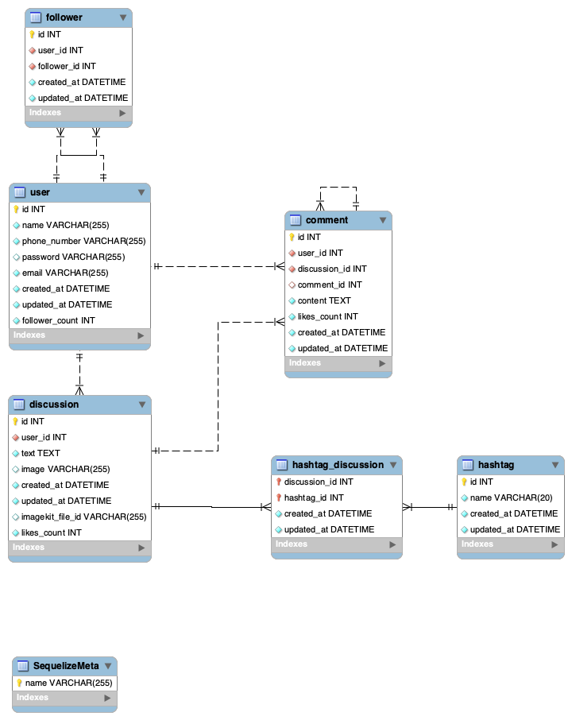
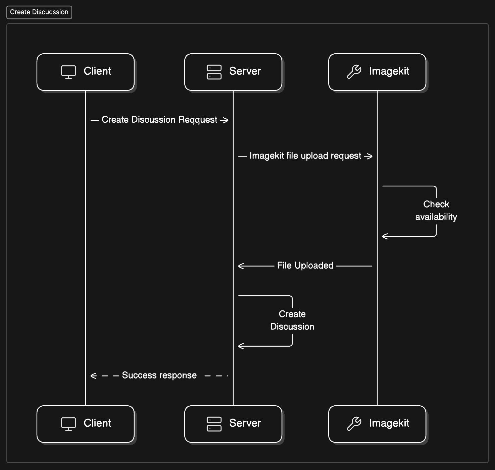
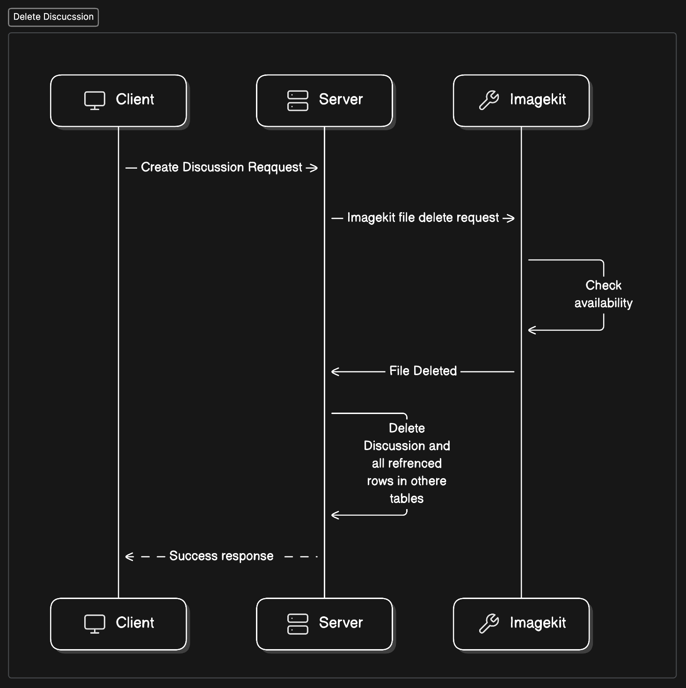

# Spyne Backend Task

This Task tries to satisfies all the points assigned in the SPYNE backend assignment.

# Deployed URL : 
https://spyne-task.onrender.com/

# Postman collection URL :
https://documenter.getpostman.com/view/16916560/2sA3e1BVGn

## Tech Stack

**Server:** Node, Express

**Database:** MySql

## LLD

### Database Structure


### Create Discussion


### Delete Discussion



## Environment Variables

To run this project, you will need to add the following environment variables to your .env.development file you can use the .env.example and rename it to .env.development

`NODE_ENV` : developemnt or production

`DB_USER` : MySql database user

`DB_PASSWORD` : MySql database password

`DB_NAME` : Database name to be used for this project it can be "openinapp_development"

`DB_HOST` : 127.0.0.1 or host of remote db

`DB_PORT` : 3306 (PORT Number)

`SALT_ROUNDS` : No. of salt rounds for hashing passwords

`BACKEND_SERVICE_PORT` : Backend Service Port e.g. 8000

`JWT_SECRET` : Secret for JWT CREATION e.g. "adasdsd"

`IMAGEKIT_API_PRIVATE_KEY` : Image kit private key from imagekit dashboard

`IMAGEKIT_API_PUBLIC_KEY` : Image kit public Key from image kit dashboard

## Run Locally

Clone the project

```bash
  git clone https://github.com/Bharat-kr/spyne-task.git
```

Go to the project directory

```bash
  cd spyne-task
```

Install dependencies

```bash
  npm install
```

Create ENV

```bash
  touch .env.development
```
> copy the values from env example to env development


Install Sequelize-cli

```bash
  npm install -g sequelize-cli
```

Setup DB

```bash
  NODE_ENV=developement && npx sequelize-cli db:create
```

> You can change the NODE_ENV if you want to produce a test or a production DB.

if you get error like `NODE_ENV is not a recognised as a internal command`

Install the win-node-env package

```bash
   npm i win-node-env
```

Run Migrations and Seeders

```bash
  npm run db:migrate:up
  npm run db:seed:all
```
Start the server

```bash
  npm run dev
```

## Authors

- [@Bharat-kr](https://www.github.com/Bharat-kr)
